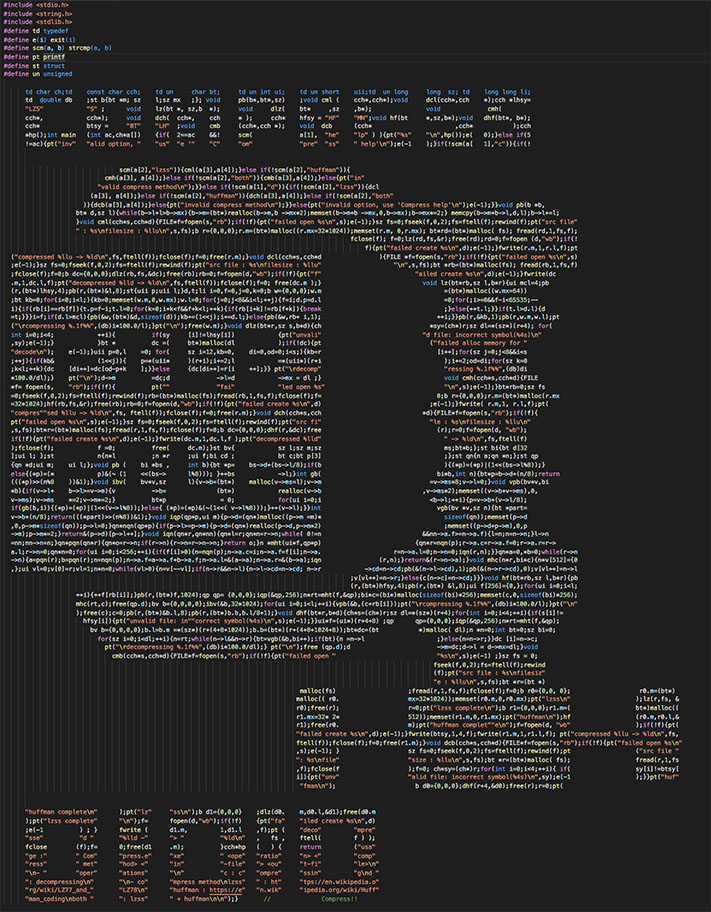

# Compressor
> ascii arted source code of basic compression program written in c++

## Build
1. make build folder in project root directory and run 'cmake ..' in build folder.
2. run 'make'

## Usage
    Compress.exe <operation> <compress method> <in-file> <out-file>

* operations
  * c : compressing
  * d : decompressing

* compress method
  * lzss : <https://en.wikipedia.org/wiki/LZ77_and_LZ78>
  * huffman : <https://en.wikipedia.org/wiki/Huffman_coding>
  * both : lzss + huffman

## Source Code Image
